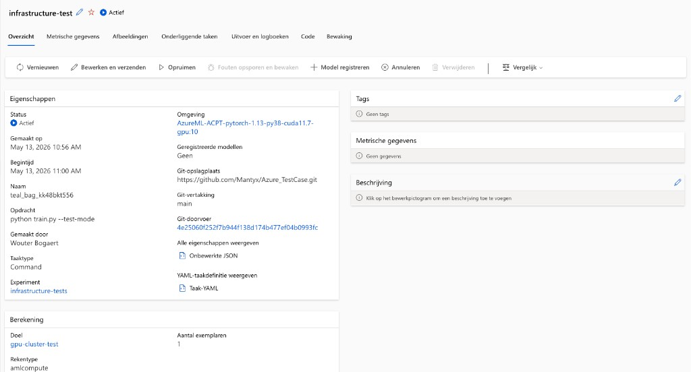

# Data Lineage

Full traceability chain from Bronze to model.

## Pipeline Flow

```
NAS  →  Bronze  →  Silver  →  Gold  →  Azure ML  →  Model Registry
         (raw)   (queryable)  (training-ready)
```

## Model Training

Azure ML training jobs are submitted via `run_training.py`. Each job is tracked in the Azure ML workspace under the `surgical-ai-training` experiment (or `infrastructure-tests` for test runs), and captures the environment, compute target, source code commit, and all hyperparameters.



*Infrastructure test job (`infrastructure-test`) running on `gpu-cluster-test` (Standard_NC4as_T4_v3), verifying that the compute cluster, PyTorch environment, and GPU are correctly configured before real training data is available.*

## Traceability Questions

- Which annotator labeled a specific frame?
- What raw Bronze file produced a Silver row?
- What query selected the training frames?
- What code, data, and hardware produced a given model version?
